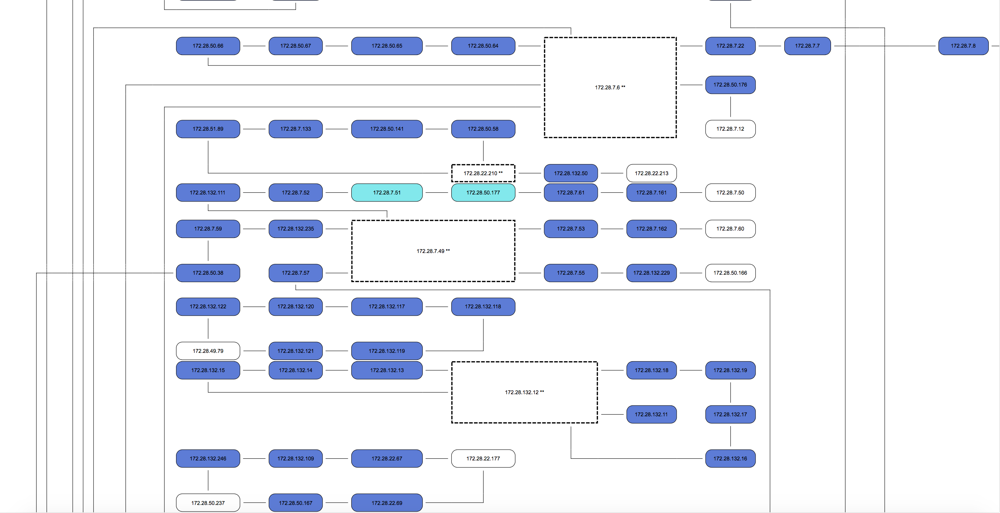

# fetchDataFromNetwork

This script uses ```Net::Telnet``` to initiate discovery on given list of IPs. It runs multi-threaded.

It also checks for some propriety stuff ( like VLAN103 is really there ), but also collects some system information and neighbourhood data.

Based on the data collected from the network, script generated a network map ( in HTML format ) showing uptimes ( based on colors ) to identify possible problems if your monitoring/alarm systems are not clever enough.

I will also try to add a sample output HTML file later.

# Requirements to run script ( not the binary for Windows Environment )
Perl modules that are needed to be installed are ;
* Graph::Easy
* Net::Telnet
* Statistics::Lite
* Term::Readpassword::Win32

# How to run ?

Before you run, you need to change few lines if you would like to update your executable script via a Private SVN Repository ;
```perl
my $svnrepourl  = ""; 												# Your private SVN Repository (should be served via HTTP). Do not forget the last /
my $SVNUsername = "";													# Your SVN Username
my $SVNPassword = "";													# Your SVN Password
```
```
fetchFromNetwork v0.5.8
This script connects to IPs that are given as input file, then parses the output for relative commands.

Author            Emre Erkunt
                  (emre.erkunt@gmail.com)

Usage : fetchFromNetwork [-i INPUT FILE] [-v] [-o OUTPUT FILE] [-u USERNAME] [-p PASSWORD] [-t THREAD COUNT] [-g] [-a ACL FILE] [-n]

Example INPUT FILE format is ;
------------------------------
Ci Name;IpAddress
nw_sf_s033_a1.34_byld_vatan212sokak_yukseloglug_7_7;172.28.191.196
nw_sf_s033_a1.34_byld_yesil_a_6;172.28.191.194
nw_sf_s033_a1.34_byld_yesil_a_7;172.28.191.193
------------------------------

 Parameter Descriptions :
 -i [INPUT FILE]        Input file that includes IP addresses
 -o [OUTPUT FILE]       Output file about results
 -u [USERNAME]          Given Username to connect NEs
 -p [PASSWORD]          Given Password to connect NEs
 -a [ACL FILE]          ACL File that you would like to compare with.
 -n                     Skip self-updating
 -t [THREAD COUNT]      Number of threads that should run in parallel      ( Default 2 threads )
 -g                     Generate network graph                             ( Default OFF )
 -v                     Disable verbose                                    ( Default ON )

```

# Example Graphs

Few examples are given in the repository :

* [Example #1](example_graph_output.html) ( larger )

* [Example #2](example_graph_output_2.html) ( smaller )
